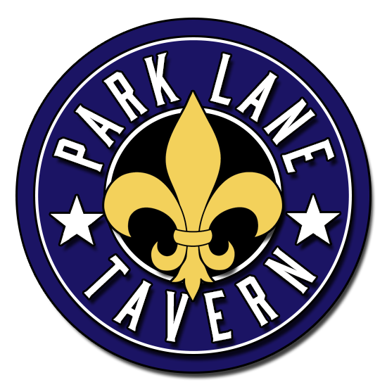

# Park Lane Tavern

## Deployment

Deployment will be used with SupervisorCTL and Gunicorn

## Built With

* [Flask/Python](http://flask.pocoo.org/) - Server Framework
* [Gunicorn](http://gunicorn.org/) - Python WSGI HTTP Server for UNIX
* [Bootstrap](http://getbootstrap.com/) - Visual Asthetics
* [Maven](https://maven.apache.org/) - Dependency Management
* [Supervisor](http://supervisord.org/) - Process Control System

## Versioning

We use [Github](http://www.github.com/) for versioning. For the versions available, see the [releases on this repository](https://github.com/wandrews1/parklanetavern/releases). 

## Authors

* **Billy Andrews** - *Back/Front End Developer* - [Github](https://github.com/wandrews1)
* **Xiaoying Riley** - *Template* - [3rd Wave Media](http://themes.3rdwavemedia.com/)

## License

This product is not licensed for outside use.